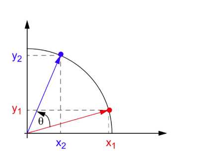
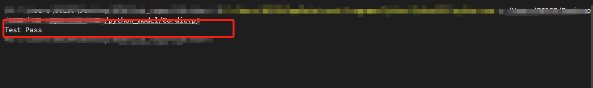
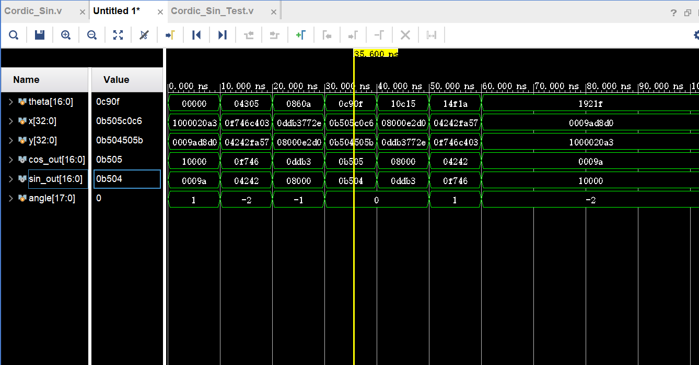

计算机该如何求解三角函数？或许你的第一印象是采用泰勒展开，或者采用多项式进行逼近。对于前者，来回的迭代计算开销成本很大；对于后者，多项式式逼近在较窄的范围內比较接近，超过一定范围后，就变得十分不理想了。例如 x-->0 时，x~sin(x)

今天，我们将要介绍三角函数的另一种求法：CORDIC 算法

## 原理

CORDIC 的算法的核心就是通过迭代，利用三角函数的物理性质，不断累积旋转角度，从而得到所求角度的精确近似。

我们假设圆为单位圆，范围且在第一象限，如下图：



我们假设点（x1,y1）与 X 轴正半轴夹角为 α,那么

$$
\begin{cases}
y_2=sin(α+θ)\\
x_2=cos(α+θ)
\end{cases}
$$

三角函数展开有

$$
\begin{cases}
y_2=sin(α)cos(θ)+cos(α)sin(θ)\\
x_2=cos(α)cos(θ)-sin(α)sin(θ)
\end{cases}
$$

将

$$
\begin{cases}
y_1=sin(α)\\
x_1=cos(α)
\end{cases}
$$

带入上式，有

$$
\begin{cases}
y_2=sin(α)cos(θ)+cos(α)sin(θ)=y_1cos(θ)+x_1sin(θ)=cos(θ)(y_1+x_1tan(θ))\\
x_2=cos(α)cos(θ)-sin(α)sin(θ)=x_1cos(θ)-y_1sin(θ)=cos(θ)(x_1-y_1tan(θ))
\end{cases}
$$

默认初始值为（1，0），记为

$$
v_0=\begin{bmatrix}
	1\\
	0
\end{bmatrix}
$$

以上的等式可以表示为旋转矩阵的形式

$$
\begin{bmatrix}
	x_2\\
	y_2
\end{bmatrix}
=cos(α)
\begin{bmatrix}
	1 & -tan(α)\\
	tan(α)&1
\end{bmatrix}
\begin{bmatrix}
	x_1\\
	y_1
\end{bmatrix}
$$

如果将令角度 α，满足 tan(α)=2<sup>-i</sup>, 那么就将 tan 和乘法运算就变成乘 2 的负次幂。对应在计算机中，就是移位计算。因而复杂的计算，就变成了简单的加减和移位运算。

所以我们有

$$
\begin{bmatrix}
	x_n\\
	y_n
\end{bmatrix}
=cos(α_n)
\begin{bmatrix}
	1 & -2^{-n}\\
	2^{-n}&1
\end{bmatrix}
\begin{bmatrix}
	x_{n-1}\\
	y_{n-1}
\end{bmatrix}=
cos(α_n)cos(α_{n-1})..cos(α_0)
\begin{bmatrix}
	1 & -2^{-n}\\
	2^{-n}&1
\end{bmatrix}
\begin{bmatrix}
	1 & -2^{-n+1}\\
	2^{-n+1}&1
\end{bmatrix}
..
\begin{bmatrix}
	1 & -2^{-0}\\
	2^{-0}&1
\end{bmatrix}
\begin{bmatrix}
	1\\
	0
\end{bmatrix}
$$

## 处理细节

**1. 缩放因子**

由前面推导，我们可以得到：

$$
\begin{bmatrix}
	x_n\\
	y_n
\end{bmatrix}
=cos(α_n)
\begin{bmatrix}
	1 & -2^{-n}\\
	2^{-n}&1
\end{bmatrix}
\begin{bmatrix}
	x_{n-1}\\
	y_{n-1}
\end{bmatrix}=
cos(α_n)cos(α_{n-1})..cos(α_0)
\begin{bmatrix}
	1 & -2^{-n}\\
	2^{-n}&1
\end{bmatrix}
\begin{bmatrix}
	1 & -2^{-n+1}\\
	2^{-n+1}&1
\end{bmatrix}
..
\begin{bmatrix}
	1 & -2^{-0}\\
	2^{-0}&1
\end{bmatrix}
\begin{bmatrix}
	1\\
	0
\end{bmatrix}
$$

我们可以提前将所有的 cos(α)的乘积计算出来，做为一个常量，省去乘法运算，记为 K

$$
K=cos(α_n)cos(α_{n-1})cos(α_{n-2})...cos(α_0)=0.60725
$$

**2. 旋转方向**

通常来说 CORDIC 算法会引入 d<sub>n</sub> ，来判断旋转方向。当前角度大于该次迭代的角度，d<sbu>n<sub>为正，逆时钟旋转，反之为负，顺时针旋转。之所以会采用双旋转，是因为其通常比单向旋转的收敛性更好，结果更精确。

因而我们迭代可以写为

$$
\begin{cases}
y_{n+1}=y_n+d_n*x_n*2^{-n}\\
x_{n+1}=x_n-d*y_n*2^{-n}\\
angle_{n+1}=angle_{n}-d*tableofangles[n]
\end{cases}
$$

table_of_angles 存储的是 θ 值， θ<sub>n</sub>=arctan(2<sup>-n</sup>);

对应的表格如下：

| n   | 2^(-n)      | arctan(2^(-n)) |
| --- | ----------- | -------------- |
| 0   | 1           | 0.785398163    |
| 1   | 0.5         | 0.463647609    |
| 2   | 0.25        | 0.244978663    |
| 3   | 0.125       | 0.124354995    |
| 4   | 0.0625      | 0.06241881     |
| 5   | 0.0315      | 0.031239833    |
| 6   | 0.015625    | 0.015623729    |
| 7   | 0.0078125   | 0.007812341    |
| 8   | 0.00390625  | 0.00390623     |
| 9   | 0.001953125 | 0.001953123    |
| 10  | 0.000976563 | 0.000976562    |
| 11  | 0.000488281 | 0.000488281    |
| 12  | 0.000244141 | 0.000244141    |
| 13  | 0.00012207  | 0.00012207     |
| 14  | 6.10352E-05 | 6.10352E-05    |
| 15  | 3.05176E-05 | 3.05176E-05    |

下面我会手把手带领大家从软件建模到硬件实现 CORDIC 算法，规定输入和输出都是无符号 17 位数，1 位整数位，16 位小数位。

## Python 代码

**测试代码**

```python
#初始化部分，定义参数
import math
from math import floor

NUM_ITER = 16
Frac_Bits=16
Data_Scale=2**Frac_Bits
Angles_Table=[]

#创建对应的对应的角度表
def create_angel_table():
    for i in range(NUM_ITER):
        angles=math.atan(2**(-i))
        angles=floor(angles*Data_Scale+0.5)/Data_Scale
        #print(angles)
        #print(angles)
        #angles=angles*(1<<Frac_Bits)+0.5
        #angles=floor(angles)
        #print(angles)
        #print(hex(angles))
        Angles_Table.append(angles)

#计算出缩放因子
def compute_k():
    k=1.0
    for i in range(NUM_ITER):
        angles=math.atan(2**(-i))
        k=k*math.cos(angles)
    #print(K)
    #print(hex(floor(K*(1<<Frac_Bits)+0.5)))
    return  floor(k*Data_Scale+0.5)/Data_Scale

# cordic 算法迭代
def cordic(theta,k):
    x=k
    y=0
    angle_temp= floor(math.radians(theta)*Data_Scale+0.5)/Data_Scale
    for i in range(NUM_ITER):
        if(angle_temp>=0):
            x_next=x-y*2**(-i)
            y_next=y+x*2**(-i)
            angle_temp-=Angles_Table[i]
        else:
            x_next=x+y*2**(-i)
            y_next=y-x*2**(-i)
            angle_temp+=Angles_Table[i]
        x=x_next
        y=y_next
    return x,y

#cordic 算法算出的结果，与真实结果进行比较
def compare(ground_truth, test):
    for i in range(len(ground_truth)): # 如果误差超过 3*2^（-16）次，那么退出比较
        if( abs(ground_truth[i]-test[i])>3):
            print("Error! Loss of accuracy! ground_truth: %f, test: %f", ground_truth[i], test[i])
            return False
    return True
#得到cordic算法结果，经行比较
def main():
    create_angel_table()
    k=compute_k()

    cos_truth=[]
    sin_truth=[]
    cos_test=[]
    sin_test=[]

    for i in range(90):
        cos_truth.append(floor(math.cos(i*math.pi/180)*Data_Scale+0.5))
        sin_truth.append(floor(math.sin(i*math.pi/180)*Data_Scale+0.5))
        cos_temp,sin_temp=cordic(i,k)
        cos_test.append(floor(cos_temp*Data_Scale+0.5))
        sin_test.append(floor(sin_temp*Data_Scale+0.5))

    if (compare(cos_truth,cos_test) and compare(sin_truth,sin_test)):
        print("Test Pass")
    else:
        print("Test Fail")

if __name__ == "__main__":
   main()
```

**比较结果**



由此可知，CORDIC 算法精度很高

## Verilog 代码

**模块代码**

```verilog

module Cordic_Sin(
    input wire [16:0] theta,   // 输入角度（Q1.16格式，范围0 ~ π/2）
    output wire [16:0] sin_out, // 输出sin值（Q1.16格式）
    output wire [16:0] cos_out
);

// 预计算参数（Q1.16格式）
localparam signed [16:0] K =17'sh09B75;  // 1/1.64676补偿因子;  17'h1A592;

//Q1.15
reg signed [16:0] angles [0:16];    //arctan(2^-i)
integer iter;
initial begin
    angles[0]  = 17'h0C910;
    angles[1]  = 17'h076B2;
    angles[2]  = 17'h03EB7;
    angles[3]  = 17'h01FD6;// i=0~3
    angles[4]  = 17'h00FFB;
    angles[5]  = 17'h007FF;
    angles[6]  = 17'h00400;
    angles[7]  = 17'h00200;// i=4~7
    angles[8]  = 17'h00100;
    angles[9]  = 17'h00080;
    angles[10] = 17'h00040;
    angles[11] = 17'h00020;// i=8~11
    angles[12] = 17'h00010;
    angles[13] = 17'h00008;
    angles[14] = 17'h00004;
    angles[15] = 17'h00002;// i=12~15
    angles[16] = 17'h00001;
end

reg signed [32:0]x,y; //初始化 x=K; y=0
reg signed [32:0]x_next,y_next;
reg signed [17:0] angle; // 初始化角度等于输出角度
integer i;

always@(*)begin
    //初始化
    x={K,16'b0};
    y=33'h0;
    angle={1'b0,theta};
    //迭代计算
    for(i=0;i<16;i=i+1)begin
        if(!angle[17])begin   //
            //正向旋转
            x_next=x-(y>>>i);  //算术移位
            y_next=y+(x>>>i);
            angle=angle-{1'b0,angles[i]};
        end else begin
            //负向旋转
            x_next=x+(y>>>i);
            y_next=y-(x>>>i);
            angle=angle+{1'b0,angles[i]};
        end
        x=x_next;
        y=y_next;
    end
end

assign sin_out = y[32:16];
assign cos_out = x[32:16];

endmodule

```

**Test Bench**

```verilog
`timescale 1ns / 1ps


module Cordic_Sin_Test();

 reg  [16:0] theta;
 wire [16:0] sin_out;
 wire [16:0] cos_out;

initial begin

     theta=17'h0;
     #10;
     //15
     theta=17'h4305;
     #10;
     //30
     theta=17'h860A;
     #10;
     //45
     theta=17'hC90F;
     #10;
     //60
     theta=17'h10C15;
     #10;
     //75
     theta=17'h14F1A;
     #10;
     //90
     theta=17'h1921F;
     #10;

end

   Cordic_Sin uut(
    .theta(theta),   // 输入角度（Q1.16格式，范围0 ~ π/2）
    .sin_out(sin_out),// 输出sin值（Q1.16格式）
    .cos_out(cos_out)
);

endmodule

```

**仿真结果**



以上的数据，输入数据需要将其转换成弧度值，然后转换成 S0I1F16 定点格式，sin,cos 准确值也是一样

| 输入角度 | sin 准确值 | cos 准确值 | sin 计算值 | cos 计算值 |
| :------: | :--------: | ---------- | ---------- | ---------- |
|    0°    |     0      | 65536      | 154        | 65536      |
|   15°    |   16962    | 63303      | 16962      | 63302      |
|   30°    |   32768    | 56756      | 32768      | 56755      |
|   45°    |   46341    | 46341      | 46340      | 46341      |
|   60°    |   56756    | 32768      | 56755      | 32768      |
|   75°    |   63303    | 16962      | 63302      | 16962      |
|   90°    |   65536    | 0          | 65536      | 154        |

除了个别点外的绝对误差比较大外，其余的计算精度相当高，误差很小
